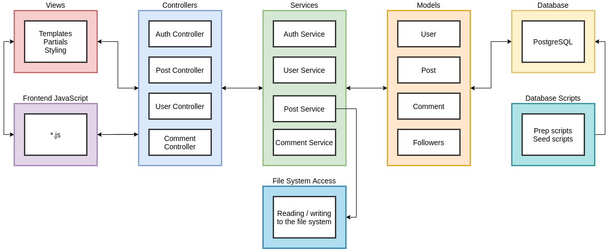

# Architecture

## Overview

This project is based on a modified MVC pattern. Between the controller and the model we have a service layer which is responsible for low level input validation and business logic independent of the model. An example of this business logic would be file system access for reading / writing images to the servers local files system.

### View

The view layer is the top level which is responsible for the front end of our application. This layer will be served by the respective controllers and allows for the user to invoke asynchronous javascript functions.

### Controller

The controller layer is very lean and only handles the routing of our application and minimal input validation through various middleware functions. The session middleware, as an example, will be added as a decorator to the controller functions, which will then inject the user id associated with the current session. Most of the controllers follow a standard GET or POST redirect pattern. Some of the controllers are JSON api endpoints, these have no GET method and will return JSON data instead of server side rendered html templates.

### Service

The service layer allows for the re-use of some business logic between our controllers and models. We can also use this layer to interact with other systems such as the file system, further validate user input, and validate database output before the controller layer. This, again, allows for very slim controllers who have the very basic purpose of HTTP routing, and prevents the overcrowding of our models with non-model related business logic.

### Model

The model layer acts as the api for our database related business logic. The project uses the SQLAlchemy package as our ORM in order to interface with the database. The `models.py` file contains all our models which map to the corresponding database tables, but also provide custom relations and helper functions.

## Block Diagram

